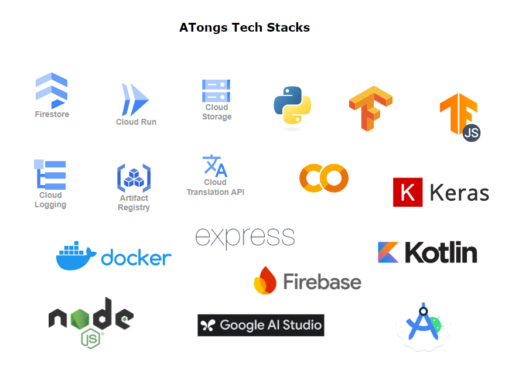
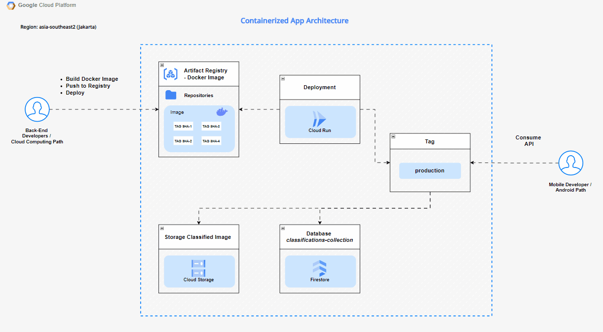
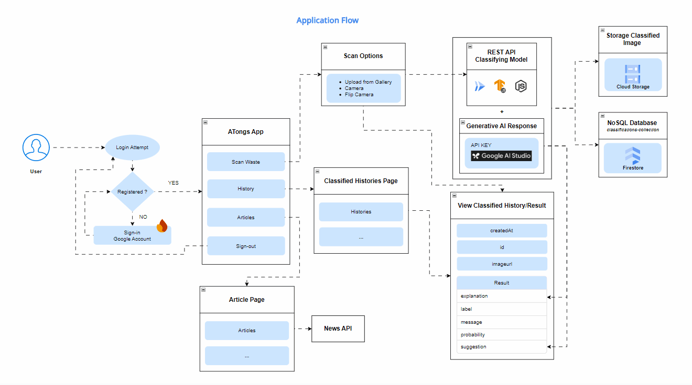

# ATongs Backend

## Table of Contents

- [ATongs Backend](#atongs-backend)
  - [Table of Contents](#table-of-contents)
  - [Description](#description)
  - [Tech Stacks](#tech-stacks)
  - [Infrastructure Diagram](#infrastructure-diagram)
  - [Application Flow](#application-flow)
  - [API Documentation](#api-documentation)
  - [Deploy on GCP](#deploy-on-gcp)

## Description
This repository is for the Backend side of the ATongs Application. The results will be an Endpoint URL that will be used when classifying waste in the ATongs App which will be consumed by the Mobile Development Team as an ML Model classification API.

## Tech Stacks

## Infrastructure Diagram

## Application Flow

## API Documentation

Check ATongs API's Postman Documentation [here](https://documenter.getpostman.com/view/24299358/2sA3XSB1Ut)  
Also check API [Testing Example](testing-api.md)

## Deploy on GCP

Follow this [steps](setup.md)